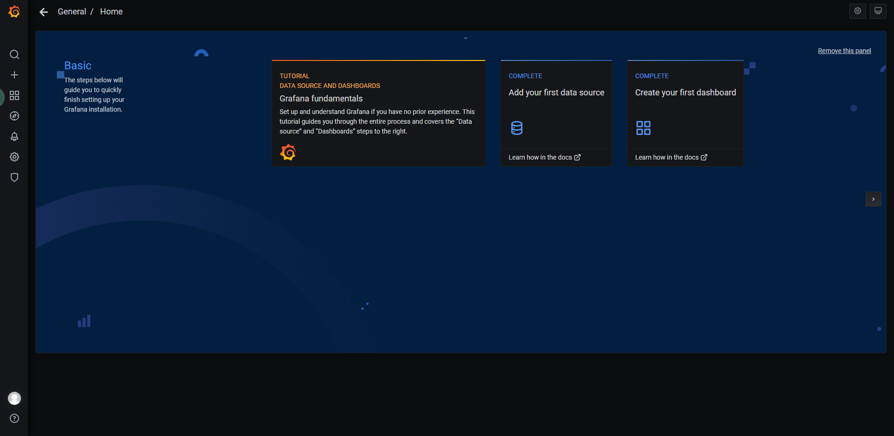
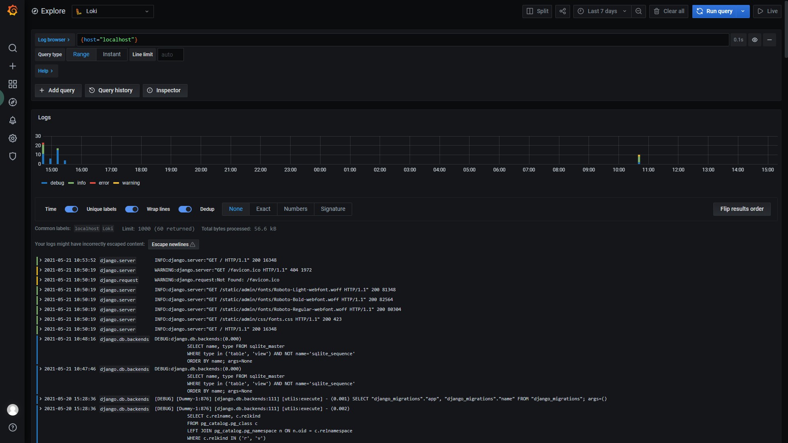

# Django-loki
Logging handler and formatter with grafana/loki for django

# Install Grafana

This section discusses the hardware and software requirements as well as the process of installing Grafana on different operating systems. This section has the following topics:

- [Requirements](https://grafana.com/docs/grafana/latest/installation/requirements/)

- [Install on Debian or Ubuntu](https://grafana.com/docs/grafana/latest/installation/debian/)

- [Install on RPM-based Linux (CentOS, Fedora, OpenSuse, RedHat)](https://grafana.com/docs/grafana/latest/installation/rpm/)

- [Install on macOS](https://grafana.com/docs/grafana/latest/installation/mac/)

- [Install on Windows](https://grafana.com/docs/grafana/latest/installation/windows/)

- [Run Docker image](https://grafana.com/docs/grafana/latest/installation/docker/)

- [Deploy Grafana on Kubernetes](https://grafana.com/docs/grafana/latest/installation/kubernetes/)

  

# Install Loki

## Installation methods

Instructions for different methods of installing Loki and Promtail.

- [Install using Tanka (recommended)](https://grafana.com/docs/loki/latest/installation/tanka/)

- [Install through Helm](https://grafana.com/docs/loki/latest/installation/helm/)

- [Install through Docker or Docker Compose](https://grafana.com/docs/loki/latest/installation/docker/)

- [Install and run locally](https://grafana.com/docs/loki/latest/installation/local/)

- [Install from source](https://grafana.com/docs/loki/latest/installation/install-from-source/)

  

# Django-loki Usage

